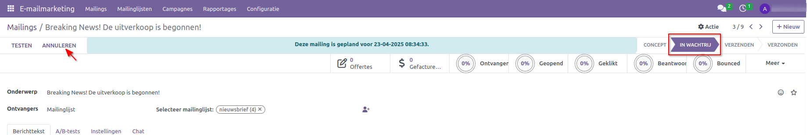
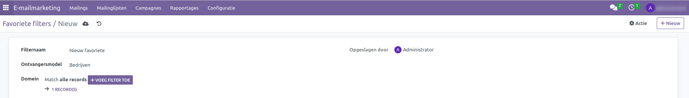

Email Marketing
===============

Inleiding
---------
CURQ biedt een **E-mail Marketing module** aan waarmee je specifieke advertenties of andere marketinggerelateerde berichten kunt versturen naar een geselecteerde groep mensen of klanten, met als doel effectieve communicatie te bevorderen.

**Belangrijk! Om e-mailmarketing te gebruiken, moet je je eigen mailserver gebruiken. Aan het einde van dit document bespreek ik een aantal opties.**

Mailings
--------
Wanneer je de **E-mail Marketing module** opent, zie je een overzicht van alle mailings, zoals hieronder weergegeven.

In de bovenstaande afbeelding zie je standaard dat de mailings zijn voorzien van essentiële informatie zoals de **datum, onderwerp, verantwoordelijke** persoon, **A/B-test** en opties zoals **verzonden, afgeleverd, geopend, geklikt, beantwoord** en **status**". De pagina bevat een overzicht van al gemaakte mailings, die op verschillende manieren bekeken kunnen worden, waaronder **"Kanban, List, Calendar en grafiek weergave**. In de buurt van de status zie je ook een icoon voor het aanpassen van voorkeuren. Door erop te klikken krijg je drie opties: **Ontvangers, Campagne** en **Bounced**. Het selecteren van een van deze opties toont de resultaten op de overzichtspagina zelf.

Er zijn twee manieren om de mailinglijst te exporteren: of door op de downloadknop in het overzichtgedeelte te klikken, of door de volledige lijst te selecteren, naar **Actie** te navigeren en vervolgens **Exporteer** te selecteren. Het bestand wordt automatisch gedownload naar je systeem.

Begin met het maken van je eerste mailing door op het **+Nieuw** icoon te klikken. Wanneer je een nieuwe mailing maakt op de aanmaakpagina, is de eerste stap het invoeren van het **onderwerp** van de mailing. Je kunt ook emoji’s toevoegen aan de onderwerpregel door ze te selecteren via het emoji-icoon. De lijst van **ontvangers** kan worden samengesteld via het dropdownmenu. Als je de e-mail naar alle contacten wilt sturen, selecteer dan de optie **Contact** uit het dropdownmenu. Aangezien er veel opties beschikbaar zijn in de lijst, kun je degene kiezen die het beste bij je behoeften past. Als alternatief heb je de mogelijkheid om zelf een **mailinglijst** samen te stellen, die je kunt vinden in de hoofdnavigatiebalk. Je hebt ook de optie om **mailingcontacten toevoegen** door op het Gebruiker Toevoegen of Nieuw Contact icoon te klikken nabij de geselecteerde mailinglijst. Door erop te klikken word je doorgestuurd naar de **Mailinglijst Contacten** pagina, waar je contacten kunt selecteren of toevoegen aan wie de e-mail gestuurd moet worden.

Bij het aanmaken van een mailing zie je rechtsboven vier fases: **Concept, In Wachtrij, Verzenden** en **Verzonden**. Standaard staat een nieuwe mailing in de fase **Concept**.
Daarnaast zie je linksboven drie knoppen: **Verzenden, In Plannen** en **Testen**. Door op een van deze knoppen te klikken, verandert de fase op basis van de geselecteerde actie.

Je kunt ook een nieuwe mailing aanmaken vanuit het huidige mailingvenster door op de **Nieuw** knop rechtsboven op de pagina te klikken. Daarnaast heb je via het **Acties** menu de mogelijkheid om het huidige mailingrecord te **dupliceren, archiveren of verwijderen**.

Op het tabblad **Berichttekst** kun je de inhoud van de e-mail specificeren. Hier kun je een sjabloon kiezen voor de betreffende e-mail. Als je ervoor kiest om een sjabloon te gebruiken, kun je de mailing aanpassen aan je eigen voorkeuren door de blokken te selecteren die je wilt toevoegen. Je kunt het sjabloon ook bewerken en het ontwerp aanpassen via de opties in het linkerpaneel dat verschijnt wanneer je een sjabloon op het scherm selecteert.

**A/B-testen** is bedoeld om een alternatieve mailing te maken en te bepalen welke de beste resultaten oplevert. De test kan worden gemeten op basis van verschillende statistieken, zoals het hoogste openpercentage, het hoogste klikpercentage of het hoogste antwoordpercentage.

Als A/B-testanalyse nodig is, schakel je de optie **A/B-testen toestaan** in en voer je het gewenste percentage in. Standaard is het percentage ingesteld op 10%. Vervolgens kun je de **winnaarcriteria** selecteren uit het dropdownmenu, op basis van statistieken zoals openpercentages, klikpercentages of antwoordpercentages. Je kunt ook de **Finale versie verzenden op datum** instellen, die wordt gebruikt om te bepalen wanneer de winnende mailing wordt vastgesteld en verzonden.

Via het tabblad **Instellingen** kun je de pakkende previewtekst instellen die de ontvangers aanmoedigt de e-mail te openen. In veel inboxen biedt deze tekst een preview van de inhoud van de specifieke e-mail, wat de ontvanger aanspoort om de e-mail te openen.

Daarnaast kunnen **Verzenden van** en **Antwoorden naar** afzonderlijk worden ingesteld. Deze functie maakt het voor de ontvanger gemakkelijker om direct vanuit de ontvangen e-mail te reageren. Onder de optie **Bijlage toevoegen** heb je de mogelijkheid om bijlagen toe te voegen ter ondersteuning van de e-mail.Daarnaast kun je een campagne selecteren uit de vervolgkeuzelijst, die de bestaande campagnes toont die al zijn aangemaakt.

In het tabblad **Chat** kun je berichten sturen naar de volgers van de e-mail, notities loggen en activiteiten inplannen. Je kunt volgers toevoegen of selecteren door op het icoon **Volger toevoegen** te klikken. Wanneer een nieuwe volger wordt toegevoegd, wordt er een uitnodigingsmail verzonden naar het opgegeven e-mailadres. Door een bericht in te voeren in het veld **Bericht verzenden** en op de knop **Verzenden** te klikken, ontvangen alle toegevoegde volgers een e-mailmelding met het bericht. Daarnaast kun je in het tabblad **Chat** ook bestanden bijvoegen.

Wanneer je op het tabblad **Activiteiten** klikt, verschijnt er een dialoogvenster waarmee je een activiteit kunt plannen op basis van je voorkeur.

Na het invoeren van alle vereiste gegevens kun je de e-mail **verzenden, In plannen** of **testen**. Wanneer je op de knop **Verzenden** klikt, verandert de status van **Concept** naar **In Wachtrij**. Zodra de e-mail naar de betreffende gebruiker is verzonden, verandert de status van **In Wachtrij** naar **Verzonden**.

Wanneer je op **Plannen** klikt, verschijnt er een dialoogvenster met de vraag: **"Wanneer wil je je mailing verzenden?**

Je kunt de **Verzenddatum** selecteren via de kalender en op **In Plannen** klikken. Als resultaat wordt de e-mail verzonden op de geplande datum. Wanneer je op de knop **Plannen** klikt, verandert de status van **Concept** naar **Wachtrij**. Op de vooraf bepaalde datum wordt de e-mail automatisch verzonden (binnen 5 minuten na het indrukken van verzenden). Nadat het geplande bericht op de opgegeven datum en tijd is verzonden, verandert de status van **In Wachtrij** naar **Verzonden**. Indien nodig kunnen e-mails in de fase **In Wachtrij** teruggezet worden naar **Concept** door op de knop **Annuleren** linksboven te klikken. Zodra de e-mail de status **Verzonden** heeft bereikt, kan deze niet meer worden geannuleerd.

Om een specifieke e-mail te testen, kun je de knop **Testen** gebruiken. Wanneer je op de knop **Testen** klikt, verschijnt er een dialoogvenster waarin je wordt gevraagd het e-mailadres van de ontvanger in te voeren om de testmail te versturen. Na het invoeren van het e-mailadres en het klikken op de knop **Verzenden**, wordt de e-mail (binnen 2 minuten) naar de opgegeven ontvanger gestuurd. De e-mail blijft na het testen in de status **Concept**.

Na het opstellen en verzenden van de e-mail kun je de status bekijken, waaronder Offerteorder, Gefactureerd, en het totale percentage ontvangers dat de e-mail respectievelijk heeft ontvangen, geopend, geklikt, beantwoord, gebounced, verzonden of genegeerd.

Wanneer je de **Kanban** weergave van de betreffende mailing raadpleegt, zijn de statussen van alle e-mails beschikbaar, zoals geïllustreerd in de onderstaande schermafbeelding.

Mailinglijsten
---------------
Binnen de **E-mail Marketing** module heb je de mogelijkheid om e-mails te sturen naar zowel individuen als groepen mensen via de functie **Mailinglijsten**. Het creëren van mailinglijsten is ook heel eenvoudig binnen de E-mail Marketing module. Je kunt eenvoudig e-mailadressen toevoegen via de opties in het Configuratiemenu. Deze functionaliteit biedt je de flexibiliteit om aparte mailings te creëren voor verschillende gelegenheden, evenementen, promoties en bedrijfsadvertenties, allemaal toegankelijk via dit menu.

Om een **Mailinglijst** te maken, open je de **E-mail Marketing** module, navigeer je naar het tabblad **  Mailinglijsten** en klik je op **Mailinglijsten**.

Binnen de specifieke mailinglijstpagina heb je toegang tot geavanceerde opties, waaronder ontvangergegevens, eerdere mailings naar deze contacten, bouncepercentage, afmeldinformatie en blacklist-status. Met het pictogram **+Nieuw** kun je eenvoudig een nieuwe mailinglijst aanmaken.

Door op het pictogram **+ Nieuw** te klikken, ga je naar een pagina waar je de titel van de nieuwe mailinglijst kunt opgeven. Nadat je de titel hebt ingevoerd, klik je op het pictogram Opslaan om de mailinglijst aan te maken.

Mailinglijst Contacten
----------------------

Binnen het tabblad **Mailinglijsten** is er een suboptie genaamd **Mailinglijstcontacten**, waarmee je bestaande contacten kunt bekijken en nieuwe mailinglijstcontacten kunt aanmaken. Deze functie stelt je in staat om specifieke contacten toe te voegen aan aangewezen mailinglijsten.

Wanneer je dit menu opent, zie je een overzicht van de contacten die al aan de betreffende mailinglijst zijn toegevoegd, zoals hieronder weergegeven. Om een nieuw contact aan de mailinglijst toe te voegen, klik je op het pictogram **+ Nieuw**.

Bij het aanmaken van een contact voor de mailinglijst kun je de naam van het contact invoeren in het daarvoor bestemde veld, evenals het e-mailadres, mobiele nummer, titel, bedrijfsnaam en land.

Onder de sectie **Mailinglijst** kun je de lijst met contacten aanmaken of deze handmatig toevoegen via de optie Regel toevoegen. Nadat je het aanmaakproces hebt voltooid, klik je op het pictogram Opslaan om de nieuw aangemaakte lijst toe te voegen aan de bestaande lijst.

.. image:: media/emailmarketing021.png

Campagnes
----------
De **campagnes** binnen de e-mail marketingmodule dragen bij aan het vergroten van het succes van het bedrijf. De verschillende opties hiervoor zijn toegankelijk via het instellingenmenu van de module. Wanneer je de optie Mailingcampagnes inschakelt onder het instellingenmenu in de configuratie, verschijnt het campagnesmenu op de hoofdpagina van de module. 

Om **campagnes** te bekijken of nieuwe campagnes toe te voegen, open je de E-mail Marketing module en navigeer je naar het tabblad **Campagnes**. Bij het klikken zie je een pagina met de details van bestaande campagnes in verschillende fasen. Je kunt ook nieuwe fasen voor campagnes toevoegen onder de sectie **Configuratie**.

Door op het + pictogram bij elke fase te klikken, kun je campagnes toevoegen aan de stappen die je hebt gepland.

Of klik op het pictogram **+Nieuw** om de campagnenaam, de verantwoordelijke gebruiker en de relevante tags toe te voegen, zoals weergegeven in de afbeelding hieronder.

Je kunt ook een bestaande campagne openen, waar je de knop +Nieuw vindt om een nieuwe campagne aan te maken, zoals weergegeven in de afbeelding hieronder.

Om eventuele wijzigingen aan te brengen in een nieuw aangemaakte campagne, open je de betreffende campagne en bewerk je de velden die je wilt aanpassen. Als alternatief kun je in de campagne-fasenweergave op de drie puntjes naast de campagne klikken die je wilt bewerken en vervolgens **Bewerken** selecteren.

Je wordt vervolgens doorgestuurd naar een pagina die vergelijkbaar is met de onderstaande schermafbeelding. Vanaf de campagnepagina kun je een nieuwe e-mail aanmaken door te klikken op de knop **MAILING VERZENDEN** linksboven, of door **Regel toevoegen** te selecteren onder het tabblad **Mailings**.

- **Mailing Verzenden**: als je hierop klikt, ga je naar een nieuwe pagina waar je een nieuwe e-mail kunt opstellen.
- **Regel toevoegen**: dit opent een dialoogvenster waarin je direct een nieuwe e-mail kunt aanmaken.

In beide gevallen kun je beginnen met het invullen van de vereiste velden. Onder het tabblad **Instellingen** wordt het veld Campagne automatisch ingevuld.

Zodra je klaar bent met het opstellen van de e-mail, klik je op de knop **VERSTUREN**, helemaal links op de pagina. De betreffende campagne toont vervolgens alle gekoppelde mailings onder het tabblad **Mailings**. Alle mailings zijn ook beschikbaar via de slimme knop Mailings, waarmee je gedetailleerde analyses van deze e-mails kunt uitvoeren. De slimme knoppen bevatten onder andere informatie over behaalde omzet, totaal aantal offertes en aangemaakte kansen, mailings en het totaal aantal klikken.

Configuratie
------------

**Campagne Configuratie**

Zodra je de optie **Marketing Campagne** activeert via de **Instellingen** onder het **Configuratiemenu**, krijg je toegang tot de opties voor **Campagne fase** en **Campagne labels**. Om een campagnefase aan te maken, ga je naar het tabblad **Configuratie** en klik je op **Campagne fase**.

Als gevolg hiervan word je naar de pagina met de al gemaakte campagne-stappen geleid, zoals weergegeven in de onderstaande afbeelding. Om een nieuwe campagnefase aan te maken, kun je het **+NIEUW** pictogram gebruiken, waarmee je een nieuwe regel kunt toevoegen.

Om een **Campagne labels** aan te maken, ga je naar het tabblad **Configuratie** en klik je op **Campagne labels**.

Als gevolg hiervan word je naar de pagina geleid met de al gemaakte tags, zoals weergegeven in de onderstaande afbeelding. Om een nieuwe tag aan te maken, kun je het **+NIEUW** pictogram gebruiken, waarmee je een nieuwe regel kunt toevoegen.

**Link Tracker Configuratie**

De linktracker optie is handig voor het volgen van campagnes, en de relevante instellingen zijn beschikbaar in het configuratiemenu. Om toegang te krijgen, ga je naar het tabblad **Configuratie** en klik je op **Link Tracker**.

Op de pagina kun je een lijst van **linktrackers** zien met details zoals **aangemaakt op, Pagina titel, Knoplabel, Doel URL** en **aantal klikken**. Daarnaast zijn er knoppen zoals **Bezoek pagina** en **Statistieken**, die je respectievelijk naar de webpagina met de link en naar de linkstatistieken leiden. Dit stelt je in staat om het succes en de impact van je campagne-links nauwkeurig te meten. 

Om een nieuwe **linktracker** aan te maken, klik je op het **+Nieuw** pictogram en vul je de vereiste velden in zoals hieronder weergegeven.

.. image:: media/emailmarketing036.png

**Blacklisted Email Adressen Configuratie**

Als e-mails geblokkeerd moeten worden, kunnen ze worden toegevoegd aan de blacklist. De relevante opties zijn beschikbaar in het configuratiemenu. Om toegang te krijgen, ga je naar het tabblad Configuratie en klik je op **Blacklisted Email Adressen**, zoals hieronder weergegeven.

Hier krijgt u een overzicht van de e-mailadressen die op de blacklist staan. U kunt nu de optie **+NIEUW** zien om een nieuwe te maken.

De aanmaakpagina zal verschijnen zoals weergegeven in de onderstaande afbeelding. Hier kunt u nieuwe e-mailadressen aan de blacklist toevoegen om verdere communicatie te voorkomen. Voer eenvoudig het e-mailadres in dat u op de blacklist wilt zetten en klik vervolgens op de **Actief** schakelaar om de optie in te schakelen. Standaard is de **Actief**  optie ingeschakeld.

Onder de instellingenopties ziet u een functie genaamd **Blacklist optie bij afmelden**, die ontvangers helpt hun blacklist te beheren via de uitschrijfpagina. Dit geeft ontvangers de mogelijkheid om controle uit te oefenen over welke e-mails ze willen ontvangen en welke niet.

**Favoriete Filters Configuratie**

In de **E-mailmarketing** module kunt u **Favoriete Filters beheren en configureren** om uw workflow te stroomlijnen en snel toegang te krijgen tot veelgebruikte mailinglijsten of filterweergaven. Om deze functie te gebruiken, gaat u naar het tabblad **Configuratie** en selecteert u **Favoriete Filters**.

Klik op de knop **+ NIEUW** om een aangepast filter te definiëren. Voer de **Filternaam** in en specificeer de **Ontvangersmodel** (de doelgroep voor het filter). Klik ten slotte op het opslaanpictogram om het filter op te slaan.

Rapportage
----------

Om de Mass Mailing Analyse in Odoo te bekijken, navigeert u naar het tabblad **Rapportage** in de **E-mailmarketing** module, zoals weergegeven in de onderstaande afbeelding.

Zodra u zich in de Rapportageweergave bevindt, kunt u elke mailingcampagne analyseren met behulp van verschillende grafiektype zoals: staafdiagram, lijndiagram, cirkelgrafiek, gestapelde weergave. U kunt de gegevens ook sorteren in oplopende of aflopende volgorde om de prestaties beter te interpreteren.

Daarnaast kunt u kiezen uit verschillende **maatstaven** via het **MEETWAARDEN**. Deze omvatten: **Bounced, Geannuleerd, Geklikt, Geleverd**, enz. U kunt ook **filters toepassen, groeperen op** verschillende criteria (bijv. **Massamailingcampagnes, status, verzonden door**) en weergaven opslaan als favorieten voor snelle toegang in de toekomst. Deze krachtige tool helpt bij het volgen van de effectiviteit van uw e-mailcampagnes en bij het nemen van datagestuurde marketingbeslissingen.

Dedicated server
----------------
Om gebruik te maken van emailmarketing dien je een eigen SMTP server in te stellen via dedicated server. Stel hier niet je normale emailaccount in, omdat er een grote kans bestaat dat het web dit mailaccount gaat zien als spam.

**Een speciale SMTP-server instellen**:

- Ga naar **Configuratie → Instellingen**.

- Vink de optie **Dedicated Server** aan.

- Selecteer de SMTP-server als deze al is geconfigureerd, of stel een nieuwe SMTP-server in door op de link te klikken - **¨Servers voor uitgaande e-mail configureren¨**.

Er zijn verschillende aanbieders in de markt die SMTP accounts aanbieden. Onderstaand een aantal interessante opties met goede referenties:

- **Sendlayer**: zij bieden een gratis proefversie voor 200 e-mails. Daarna betaal je $ 5 per maand voor 1000 e-mails per maand. Referentielink: https://sendlayer.com/pricing

- **Brevo**: zij bieden ook een gratis account met maximaal 300 e-mails per dag. Ze hebben een optie om transactionele e-mail te gebruiken en kosten slechts € 10,00 per maand voor 20k e-mails per maand. Brevo biedt een krachtig marketing platform met transactie-e-mails, e-mailmarketing & sms-marketing. Als deze optie wordt gebruikt, dan kost het € 19,00 per maand. Referentielink: https://www.brevo.com 

- **Sendgrid**: zij bieden een gratis plan met maximaal 100 mails per dag. De volgende stap is $ 19,95 per maand voor 50k e-mails per maand. Referentielink: https://sendgrid.com
