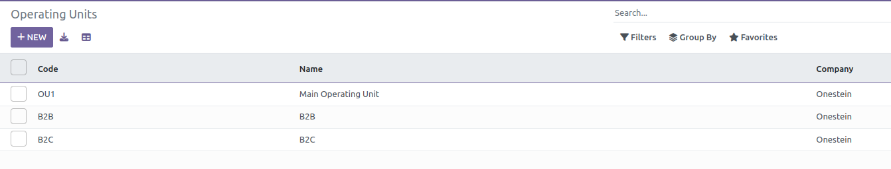
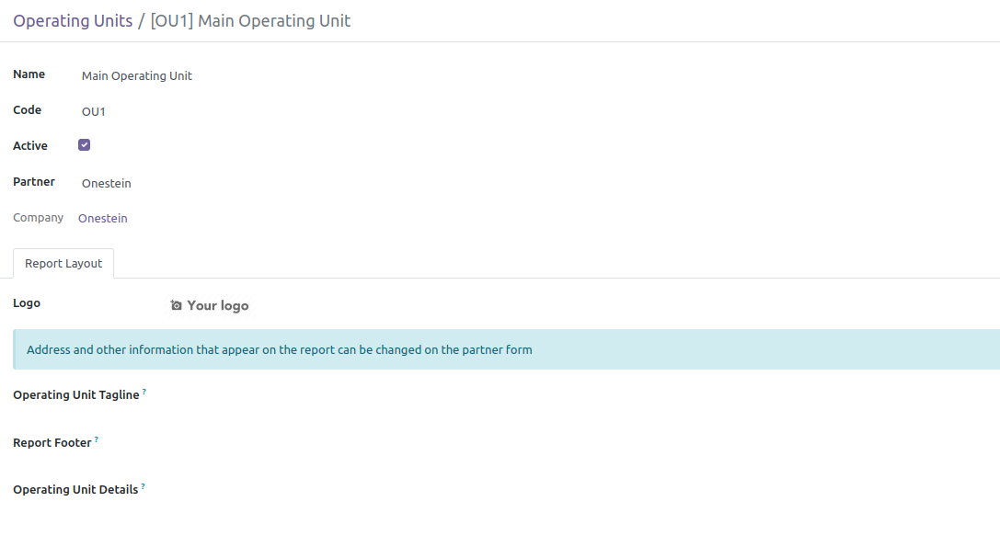
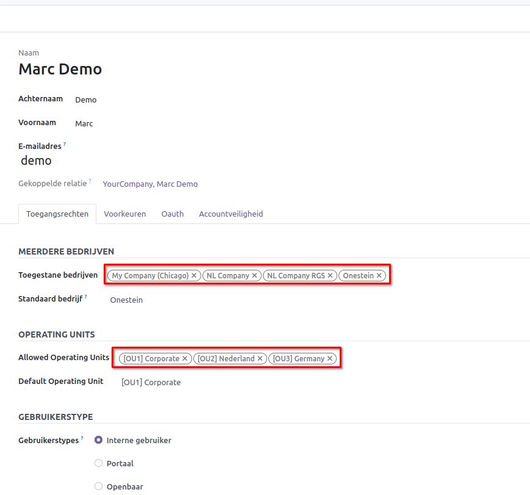
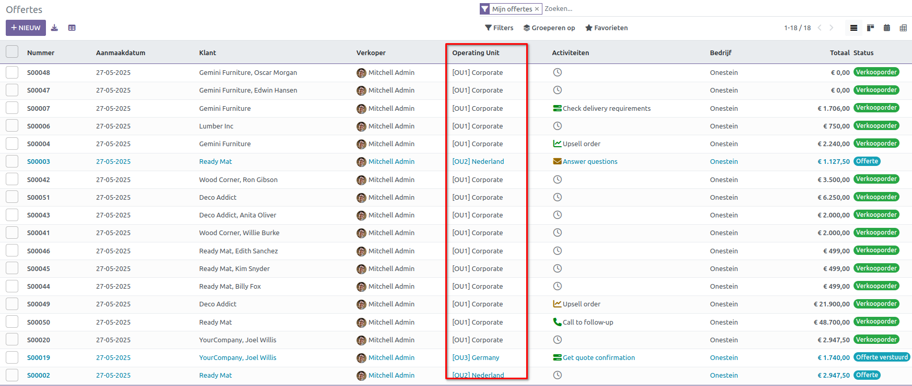
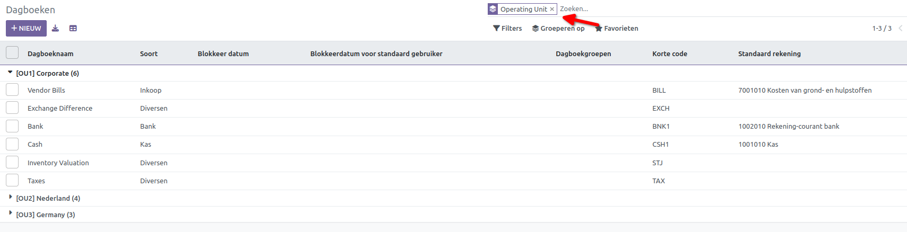
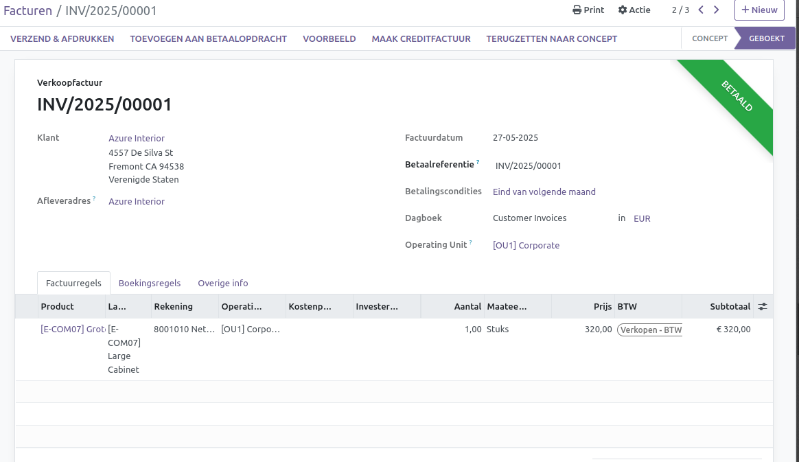
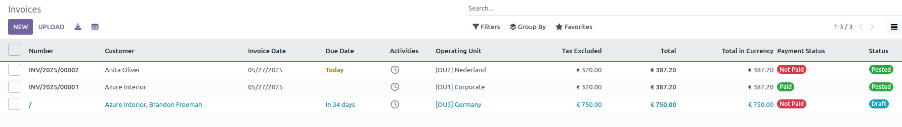

Operationele Eenheden
=====================
In CURQ worden Operationele Eenheden gebruikt om de operaties binnen hetzelfde bedrijf te segmenteren, wat zorgt voor betere tracering, rapportage en controle over verschillende businessunits of vestigingen, zonder dat er aparte bedrijven in het
systeem hoeven te worden aangemaakt.

1. Wat zijn Operating Units?
-----------------------------
Operating Units zijn onderafdelingen van één enkel bedrijf. Je kunt ze gebruiken om:

• Meerdere businessunits, afdelingen of locaties te beheren.

• Gebruikerstoegang tot gegevens te beperken op basis van hun toegewezen operating unit.

• De interne zichtbaarheid en controle te verbeteren, terwijl je één juridische entiteit behoudt.

Hoe configureer je dit?
-----------------------
1. Activeer Multi-Operating Unit:

• Ga naar Instellingen > Gebruikers & Bedrijven > Operating Units.

• Maak de benodigde Operating Units aan.

• Elke Operating Unit moet gekoppeld zijn aan een bedrijf.

• Wijs gebruikers toe aan specifieke Operating Units onder Instellingen > Gebruikers & Bedrijven.

2. Verkooporders met Operationele Eenheden:

• Bij verkooporders, inkooporders, facturen, enz. vind je een veld Operating Unit onder Overige informatie.

.. image:: media/ou004.png

• In de lijstweergave kun je zien aan welke Operationele Eenheden de verkooporder is gekoppeld.

3. Operationele eenheid in Accounting:
--------------------------------------
• Elke operationele eenheid (OU) kan zijn eigen set journaalposten hebben.

• Transacties (facturen, rekeningen, enz.) zijn gekoppeld aan specifieke OU’s.
               
• Dit kan worden ingesteld via Facturatie >> Configuratie >> Dagboeken.
               
• Bij het aanmaken van een journaal (onder Facturatie >> Configuratie >> Dagboeken), wijs je het toe aan een OU. Dit zorgt ervoor dat bij het aanmaken van facturen met dat journaal de OU automatisch wordt overgenomen.

.. image:: media/ou006.png

• In de lijstweergave kun je de journaalposten filteren op Operationele eenheid via Groeperen op >> Aangepaste groep toevoegen >> Operating Unit

• Go naar Facturatie > Klanten > Facturen > Nieuw
               
• Bij het aanmaken van een factuur zou het veld Operationele eenheid zichtbaar moeten zijn. Dit kan handmatig worden geselecteerd of automatisch ingevuld worden op basis van het journaal.                    
• Zodra de OU is ingesteld, worden alle bijbehorende boekingen gelabeld met die OU.
               
• Alleen gebruikers met toegang tot die specifieke OU kunnen de factuur bekijken of beheren (afhankelijk van hun OU-restricties).

• Voor facturen wordt de operationele eenheid weergegeven in de lijstweergave zonder dat er een filter hoeft te worden toegevoegd.

Factuurgegevens filteren op operationele eenheid
------------------------------------------------

• Facturatie >> Rapportages >> Factuuranalyse

Kun je:
               
• De filter Operating unit gebruiken om facturen te bekijken die onder een specifieke OU zijn aangemaakt.
               
• De prestaties van meerdere operationele eenheden met elkaar vergelijken.

.. image:: media/ou010.png

               
