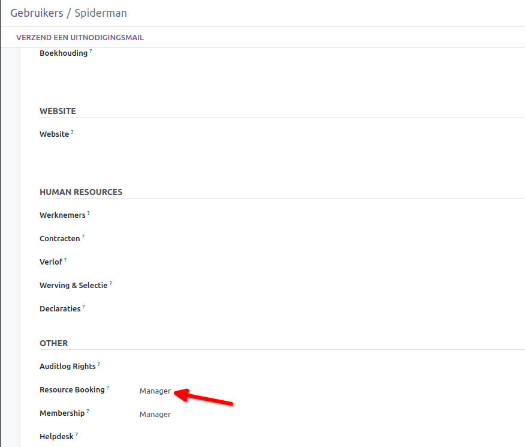
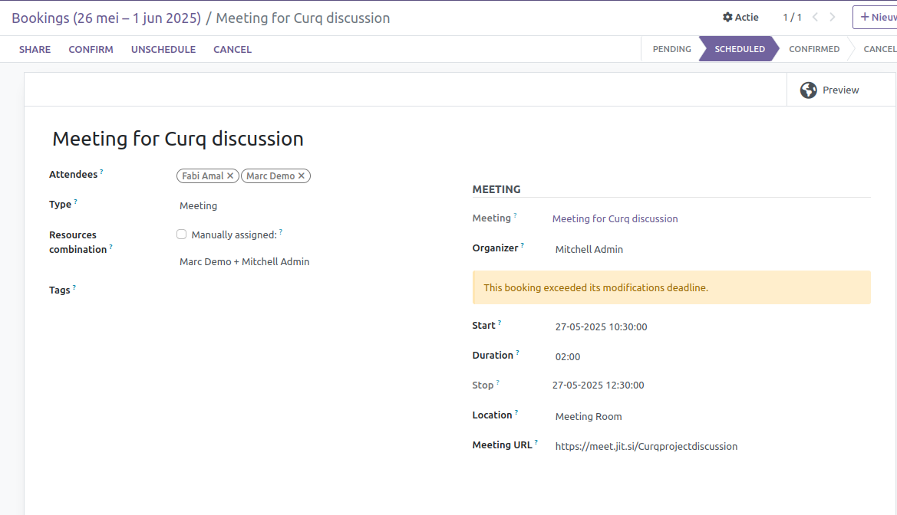
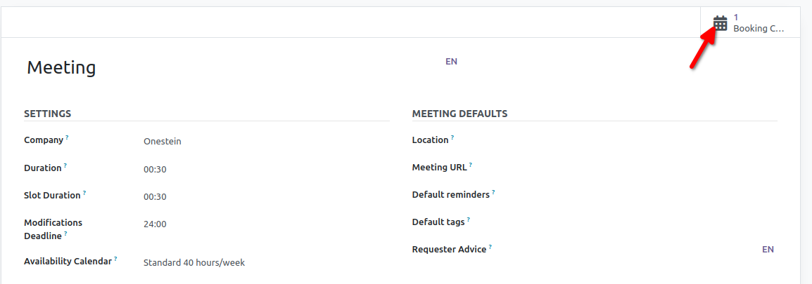
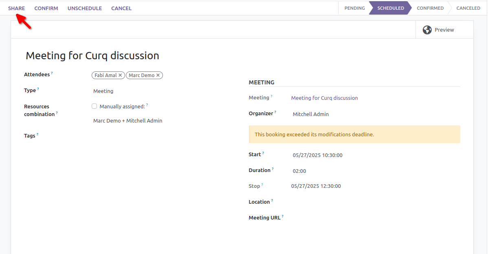
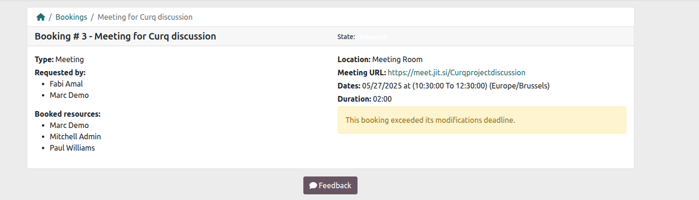

Reserveringen van Middelen
==========================
Dit reserveringssysteem is ontworpen om het beheer en de planning van middelen te vereenvoudigen door een flexibele, geautomatiseerde en gebruiksvriendelijke ervaring te bieden. Of het nu via de backend of een partnerportaal gebeurt, gebruikers kunnen eenvoudig de beschikbaarheid bekijken, reserveringen maken en planningen beheren met minimale inspanning.

Belangrijkste functionaliteiten:
---------------------------------
• Definieer het type reservering met een kalender die beschikbaarheid toont
• Reserveer meerdere middelen tegelijk (alleen als ze allemaal beschikbaar zijn)
• Maak voorlopige reserveringen zodat anderen een tijdslot kunnen kiezen
• Partners kunnen reserveren via hun portaal
• Tokenized URL’s geven toegang tot reserveringen voor partners zonder gebruikersaccount
• Backend-gebruikers kunnen reserveringen rechtstreeks vanuit de backend beheren
• Automatische reserveringscyclus met berekende statussen
• Automatisch aanmaken en verwijderen van vergaderingen
• Ingebouwde conflictdetectie bij overlappende reserveringen
• Stel deadlines in om verdere wijzigingen te blokkeren

**1) Gebruikersinstellingen**

**1.1 Om een backendgebruiker toe te staan middelen te reserveren:**

• Navigeer naar Instellingen > Gebruikers & Bedrijven > Gebruikers.
• Selecteer een bestaande gebruiker of klik op Aanmaken om een nieuwe toe te voegen.
• Ga naar het tabblad Toegangsrechten.
• Wijs de rol toe: Resource Booking > User.

.. image:: media/reservations001.png

**1.2 Om een backendgebruiker toe te staan boekingstypen en combinaties te configureren en achterstallige boekingen te wijzigen:**

1. Navigeer naar Instellingen > Gebruikers & Bedrijven > Gebruikers.
2. Selecteer een bestaande gebruiker of klik op Aanmaken om een nieuwe toe te voegen.
3. Ga naar het tabblad Toegangsrechten.
4. Wijs de rol toe: Resource Booking > Manage.

**2) Vergadertypen configureren**

"**Vergadertypen**" verwijzen meestal naar vooraf gedefinieerde sjablonen of categorieën die worden gebruikt bij het aanmaken van vergaderingen of afspraken. Ze helpen om reserveringen te standaardiseren qua weergave, duur en behee.

• Bedrijf: Het bedrijf waarmee dit vergadertype is gekoppeld.
• Duur: Standaardduur van elke boeking (bijv. 30 minuten).
• Slotduur: Tijdinterval dat wordt gebruikt om slots in de kalender weer te geven (vaak gelijk aan de Duur).
• Deadline voor Wijzigingen: Aantal uur vóór de vergadering waarin niet-managers geen wijzigingen meer kunnen aanbrengen (bijv. 24 uur vooraf).
• Beschikbaarheidskalender: De werkroosterkalender (bijv. standaard 40 uur/week) die bepaalt wanneer boekingen mogelijk zijn.

**Standaardinstellingen voor Vergaderingen**

Deze waarden worden gebruikt wanneer automatisch een vergadering wordt aangemaakt op basis van een boeking:
• Locatie: Standaardlocatie van de vergadering (bijv. Kantoorruimte A, Zoom).
• Vergader-URL: Link om deel te nemen aan de vergadering (bijv. Teams/Zoom-link).
• Standaardherinneringen: Notificaties vóór de vergadering (bijv. e-mail 10 minuten vooraf).
• Standaardtags: Labels voor het categoriseren/filteren van vergaderingen (bijv. Sollicitatiegesprek, Demo).
• Aanwijzingen voor Aanvrager: Instructies of opmerkingen voor de persoon die de boeking doet.

**Middelencombinaties**

• **Toewijzing van Combinatie**: Hoe het systeem beschikbare combinaties selecteert:
        ◦ **Willekeurig**: Elke beschikbare combinatie kan gekozen worden.

        ◦ **Gesorteerd**: Combinaties worden gekozen op basis van hun volgorde in de lijst.

• **Beschikbare Middelencombinaties**: Stel combinaties van middelen in die tegelijk beschikbaar moeten zijn voor de boeking.
• Klik op **Opslaan**.

.. image:: media/reservations003.png

**3) Boekingen aanmaken**

**3.1 Om een vergadering of boeking met geselecteerde middelen in te plannen, volg je deze stappen**:

1. Ga naar **Resource Bookings > Types**        .
2. Selecteer het gewenste boekingstype (bijv. "Vergadering").
3. Klik op **Aantal Boekingen** (Booking Count) om de beschikbaarheidskalender te bekijken.
4. Selecteer een vrij tijdslot in de kalender.
5. In het boekingsformulier dat wordt geopend:

        ◦ Vul de **Aanvrager** in (dit kan jezelf zijn of iemand anders).

        ◦ (Optioneel) Vink **Automatisch toewijzen** uit als je handmatig een andere middelencombinatie wilt kiezen.

        ◦ Kies de gewenste **Middelencombinatie** uit de lijst.

6. Controleer andere details zoals **naam van de boeking**, **datum**, **duur** en optionele **tags**.

7. Klik op **Opslaan**.

**Let op**: Als de boeking dicht bij de starttijd wordt gemaakt, kan er een waarschuwing verschijnen:

"**Deze boeking heeft de wijzigingsdeadline overschreden.**"

**3.2. Iemand uitnodigen om een middelencombinatie te reserveren via het portaal**

Met deze methode kunnen interne gebruikers een boekingsuitnodiging sturen naar een externe aanvrager. De aanvrager kan vervolgens zelf een tijdslot kiezen via zijn portaaltoegang (of via een getokeniseerde URL als hij geen gebruikersaccount heeft).

**Stappen**:

1. Ga naar **Resource Bookings > Types**
2. Selecteer het gewenste boekingstype (bijv. "Vergadering")
3. Klik op de slimme knop **Aantal Boekingen** (Booking Count) om de bestaande boekingen te bekijken

4. Schakel over naar **Lijstweergave** door op het lijstpictogram rechtsboven te klikken
5. Klik op **Aanmaken** om een nieuw boekingsformulier te openen

.. image:: media/reservations006.png

6. Vul de volgende gegevens in:
        ◦ **Aanvrager**: Voer de persoon in die je uitnodigt

        ◦ (Optioneel) Vink **Automatisch toewijzen** uit als je een specifieke **middelencombinatie** wilt selecteren. Als dit is uitgevinkt en er geen combinatie is geselecteerd, zal het                 systeem utomatisch een vrije combinatie toewijzen zodra de aanvrager een tijd kiest

        ◦ **Duur**: Pas aan als deze afwijkt van de standaardduur die is ingesteld in het boekingstype

7. Klik op het **Opslaan-pictogram**
8. Klik op **Delen**. Er verschijnt een pop-up om de uitnodiging te bevestigen en de gekoppelde middelen te informeren
9. Voeg indien nodig **notities** toe in de pop-up (optioneel)
10. Je kunt ook de **boekingslink kopiëren** vanuit de pop-up en deze handmatig met de gebruiker delen

.. image:: media/reservations008.png

11. De aanvrager ontvangt een e-mail met een link om de vergadergegevens te bekijken.

.. image:: media/reservations009.png

**Opmerking**: Als de aanvrager geen portaaltoegang heeft, wordt er een getokeniseerde link gegenereerd om de vergadergegevens te bekijken.

